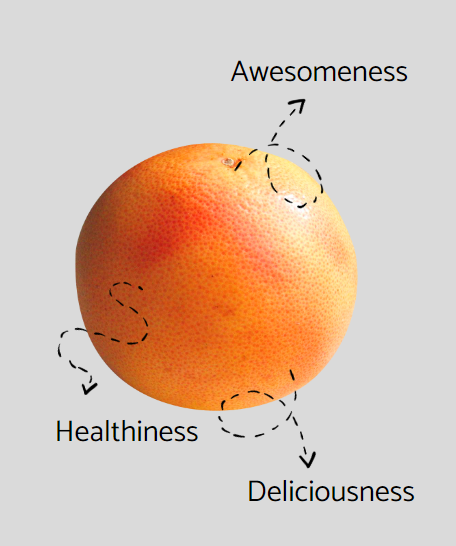

# Grapefruit Landing Page

Grapefruit is my all-time favorite fruit. So, why not use it to create a landing page for practice, treating it as if it were a product? The landing page will be designed with a mobile-first approach, using pure CSS and no frameworks.

Live site: https://feralonsomaccari.github.io/grapefruit-landing-page/



------
### Why?
I created this landing page as a practice project to enhance my web development skills. By building it without using any frameworks, I focused on honing the following aspects of web development:

- CSS
- HTML
- Mobile first approach
- Responsive design
- SEO
- BEM Naming convention

------
# Local Setup

```sh
Clone it and open index.html
```